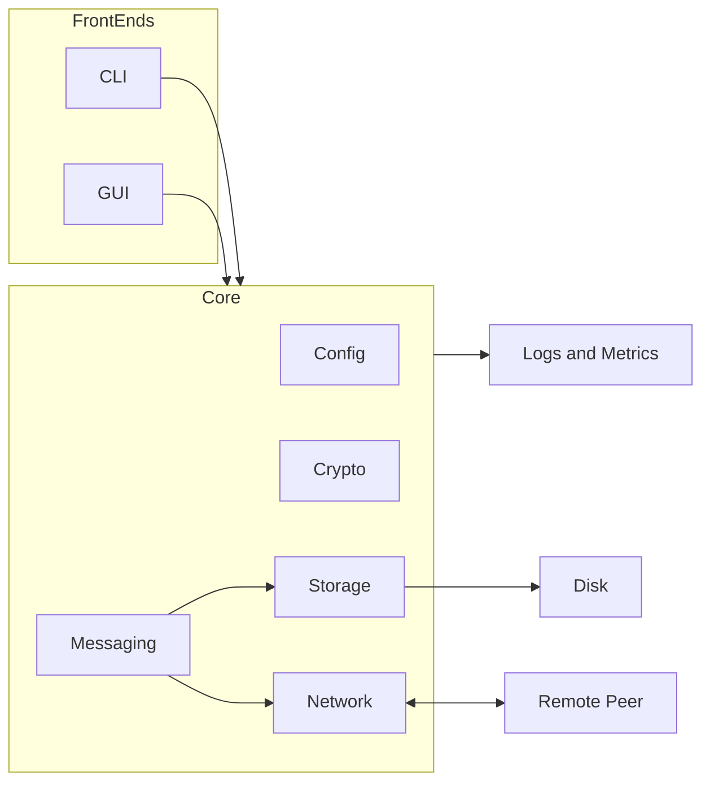
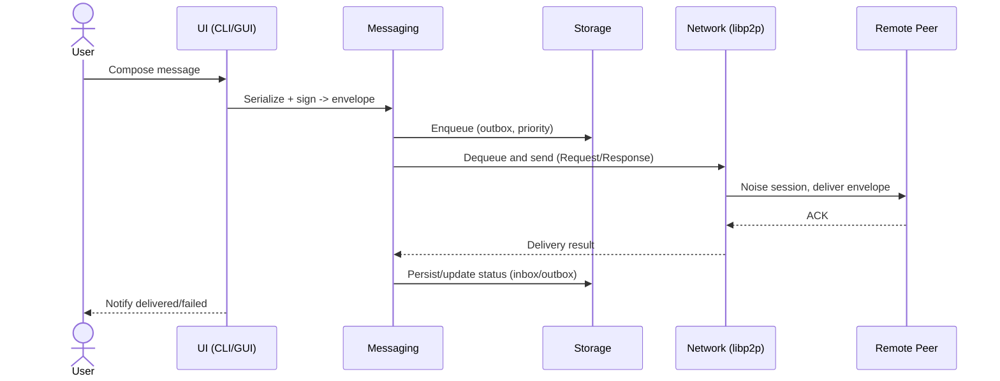
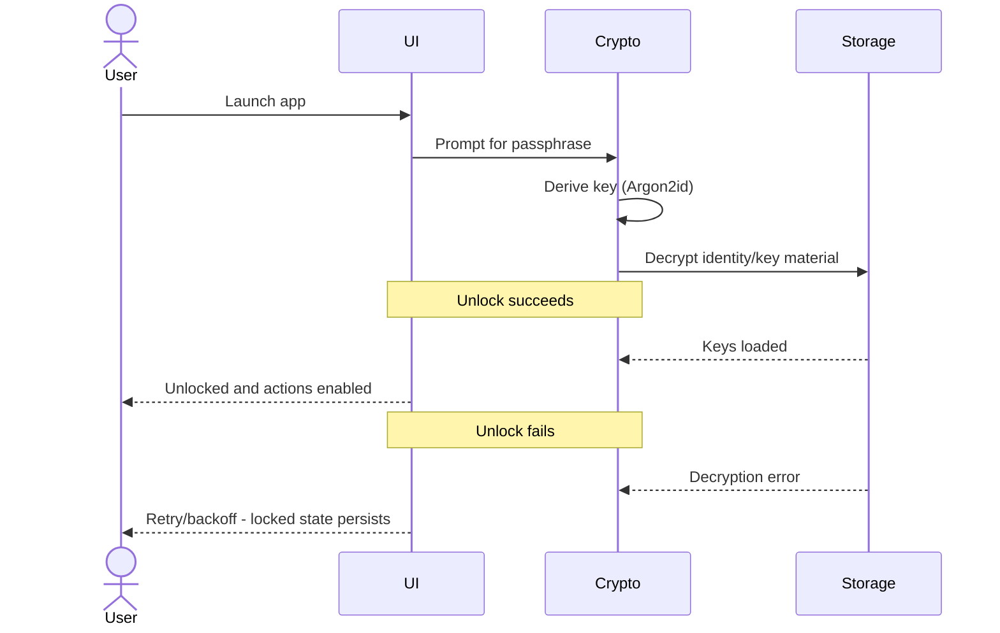
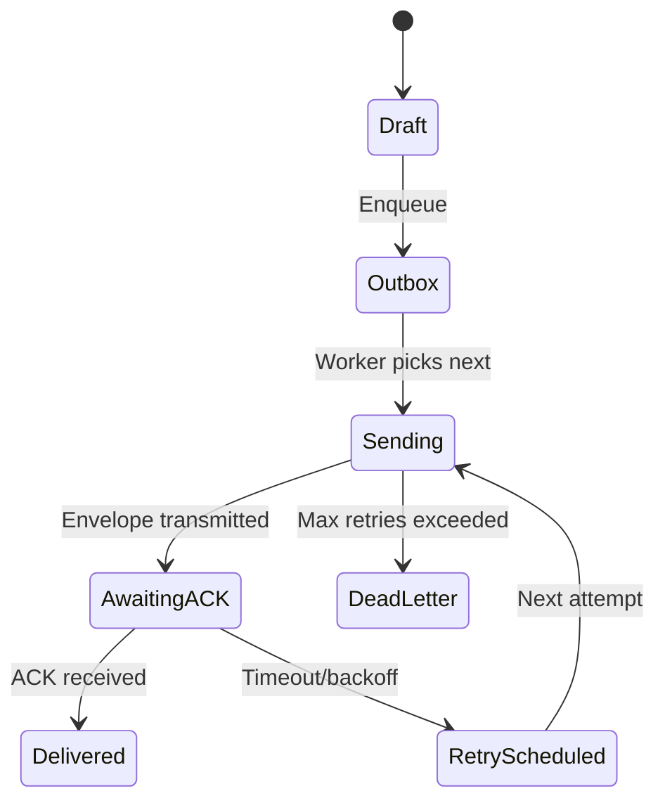
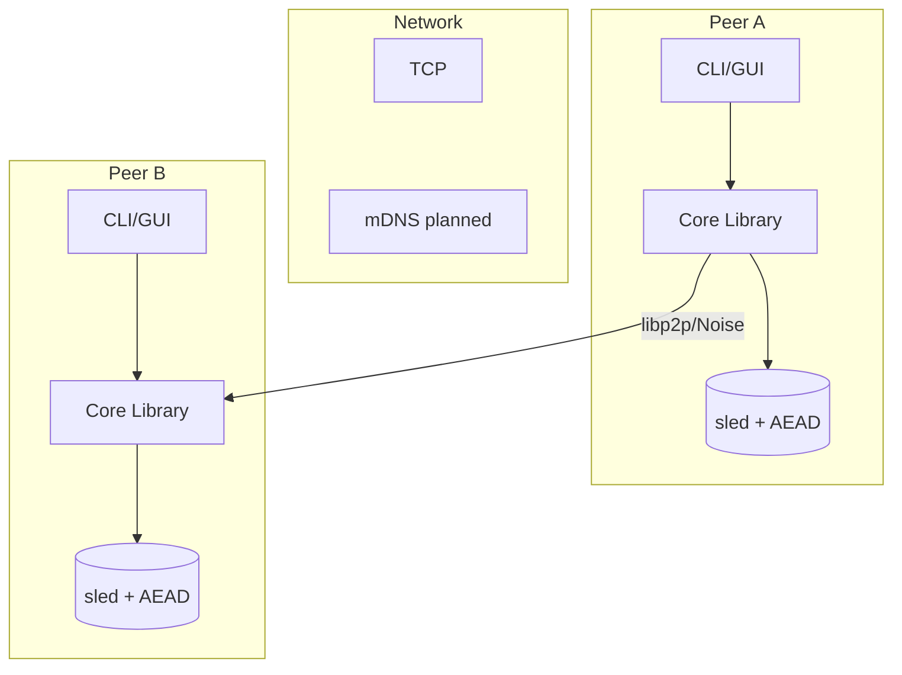

# Pigeon – Architecture Overview (Extended)

This document provides a detailed architectural overview of the Pigeon secure peer-to-peer messaging application. It is written for technically proficient readers who may only have a basic understanding of distributed systems, encryption, and peer-to-peer networking.

---

## 1. High-Level Design

Pigeon is a **desktop-first secure messaging client** built in Rust. It avoids central servers by using **direct peer-to-peer connections**. Security and reliability are baked in at every layer:

- **Rust Core Library**: All business logic is implemented in a shared library (`lib`).
- **Front-Ends**: Multiple UIs (command-line, GUI) interact with the core via well-defined APIs.
- **Core Principles**:
  - **Security by default**: All data is encrypted in transit and at rest.
  - **Determinism**: Retries, backoff, and message IDs are predictable and idempotent.
  - **Resilience**: Queues, reconnection, and error handling keep the system operational under churn.

---

## 2. Core Modules

### 2.1 Config (`config`)
- Reads from configuration files (`.toml`) and environment variables.
- Provides a strongly typed interface to other modules.
- Examples:
  - Network listen addresses
  - Storage directory paths
  - Security policies (e.g., passphrase lock enabled)

**Purpose** ensures consistent runtime behavior across platforms and environments.

---

### 2.2 Crypto (`crypto`)
- Wraps libsodium via `sodiumoxide`.
- Primitives used in the codebase:
  - Message encryption: `crypto::box_` (Curve25519-XSalsa20-Poly1305, 24-byte nonce)
  - At-rest encryption: `secretbox` (XSalsa20-Poly1305, 24-byte nonce)
  - Password-based keys: Argon2id KDF for wrapping the at-rest key
- Responsibilities:
  - Encrypt/decrypt messages using sender secret key and recipient public key
  - Derive short auth tokens via BLAKE2b-MAC when needed
  - Manage nonces by prefixing the ciphertext with the randomly generated nonce

**Purpose:** provides authenticated encryption for messages and at-rest data with well-vetted primitives.

---

### 2.3 Messaging (`messaging`)
- Defines the **envelope** structure: headers (IDs, timestamps, signatures) + encrypted payload.
- Handles **sign/verify** for sender authenticity.
- Implements **ACK-based delivery** with retry/backoff policies.
- **Queue system**:
  - Multiple priority lanes (urgent vs bulk transfers).
  - Dead-letter queues for unrecoverable failures.
  - Configurable retry strategies.

**Purpose:** guarantees reliable, authenticated message delivery even with unstable networks.

---

### 2.4 Network (`network`)
- Built on libp2p.
- Transport stack (as implemented):
  - TCP with `tokio`
  - Upgrade to Noise (authenticated encryption) and Yamux (multiplexing)
- Behaviours present:
  - `ping`: connectivity and latency checks (`network/ping.rs`)
  - Request/Response codec scaffolding (`network/rr.rs`) to carry byte payloads
- Discovery:
  - Manual dial/listen via multiaddresses
  - mDNS is enabled at the dependency level but not yet wired into a behaviour
- Notes:
  - QUIC is not enabled in the current crate configuration
  - A higher-level message protocol can be built atop the provided Request/Response codec

**Purpose:** provides the secure, multiplexed transport needed for peer-to-peer exchange.

---

### 2.5 Storage (`storage`)
- Persists data in **sled**, an embedded key-value store.
- Data encrypted-at-rest with AEAD (envelope encryption).
- Persists:
  - Local identity and private keys
  - Contacts
  - Messages (inbox, outbox, dead-letter)

**Purpose:** protects user data from local disk compromise and ensures recoverability.

---

### 2.6 UI (`ui`)
- **CLI** (M0–M2):
  - Built with `clap`.
  - Commands: add contacts, send messages, view inbox, export messages.
- **GUI** (M3):
  - Built with `egui/eframe`.
  - Features:
    - Onboarding wizard (identity generation/import)
    - Contact and inbox management
    - Compose/send with priority toggle
    - Live receive display and notifications
    - Queue view with retry/backoff visibility

**Purpose:** provides accessible workflows for users.

---

### 2.7 Core API (`api`)
- Thin facade consumed by front-ends (especially the GUI) exposing:
  - Contacts: add/list/get/update/remove
  - Messaging: compose, immediate encrypt+enqueue, inbox list/search/export, inbox watcher
  - Queue: list pending, list dead letters, stats, item summaries
  - Onboarding & identity: first-run detection, ensure identity, import
  - Security: set passphrase, unlock, rotate at-rest key
  - Settings: accessibility settings and app state (onboarding flag)
  - Ops: start metrics server, update checks

**Purpose:** concentrates user-facing operations in a stable, testable API.

---

## 3. Data Flow (Step by Step)

1. **Compose Message (UI)**
   - User writes a message.
   - Message serialized into an envelope.
   - Envelope payload encrypted with libsodium `box_` (Curve25519-XSalsa20-Poly1305, 24-byte nonce) and signed (ed25519).
   - Stored in the **outbox queue**.

2. **Queue Processing (Messaging)**  
   - Background worker drains the queue.
   - Prioritizes urgent messages.
   - Applies retry/backoff rules.

3. **Transmission (Network)**
   - Envelope bytes sent over libp2p (Request/Response when integrated).
   - Session secured with Noise over TCP; streams multiplexed with Yamux.
   - Delivered to peer’s listener.

4. **Reception (Network → Messaging)**  
   - Envelope received and decrypted.
   - Signature verified; replay cache checked.
   - ACK returned to sender.

5. **Persistence (Storage)**  
   - Accepted messages stored encrypted-at-rest.
   - Indexed for search and export.

6. **User Access (UI)**  
   - Messages displayed in inbox.
   - Notifications triggered for new arrivals.

---

## 4. Security Posture
- **Transport security:** libp2p Noise provides handshake confidentiality, integrity, and peer authentication.
- **Message confidentiality/integrity:** libsodium `box_` with 24-byte nonce; envelopes are signed with ed25519.
- **Replay protection:** nonce store prevents ciphertext replay; duplicate nonces rejected.
- **At-rest key security:** passphrase-protected at-rest key (via Argon2id + `secretbox`) with rotation support; environment variable `PIGEON_PASSPHRASE` can unlock on startup.
- **Input validation:** external inputs (config, contacts) validated at boundaries.

---

## 5. Observability & Operations
- **Logging:** uses `log` with `pretty_env_logger`.
- **Metrics:** minimal Prometheus-style exporter in `ops.rs` (HTTP plaintext) exposing counters (sent, delivered, failed, received).

---

## 6. Extensibility Points
- **Feature flags:** `network` toggles libp2p integration.
- **Modular layout:** new behaviours/protocols (e.g., Request/Response integration, discovery) and UIs can be added incrementally.

---

## 7. Data Formats & Files
- `identity.bin` (bincode): contains libp2p ed25519 key (when enabled), sodium box keypair, and ed25519 signing keypair.
- At-rest key files in the data directory:
  - `at_rest.key` (raw key) when not sealed
  - `at_rest.key.enc` (sealed): `PGN1` magic | 16-byte salt | 24-byte nonce | `secretbox`-sealed key bytes

---

---

## 8. Diagram Gallery (Mermaid)

### 8.1 Component/Context

This diagram shows how the front-ends (CLI and GUI) call into the shared Core library. The Core is split into configuration, cryptography, messaging, networking, and storage concerns. Storage persists encrypted data to disk, networking communicates with remote peers, and the Core emits logs and metrics for observability.

### 8.2 Sequence – Send ➜ Receive

This sequence outlines message delivery: the user composes in the UI, which asks Messaging to serialize and sign, then persists to the outbox. Messaging hands the next item to Networking for transmission. The remote peer acknowledges, the result flows back, status is persisted, and the UI notifies the user.

### 8.3 Sequence – Unlock Flow

This sequence depicts unlocking protected data at startup: the UI prompts for a passphrase, Crypto derives a key and attempts to decrypt at-rest material from Storage. On success, keys are loaded and the app is unlocked; on failure, the UI remains in a locked state and prompts the user to retry.

### 8.4 State – Message Lifecycle

This state machine shows a message moving from Draft to the Outbox, being picked for Sending, awaiting an acknowledgment, and either reaching Delivered or being rescheduled with backoff. After exhausting retries, the message is moved to the DeadLetter state for inspection.

### 8.5 Deployment (Peer A ↔ Peer B)

This deployment view shows two peers, each with a UI, Core library, and encrypted storage. The peers communicate via libp2p (Noise over TCP) across the Network. mDNS is depicted as a planned discovery mechanism for local networks.

